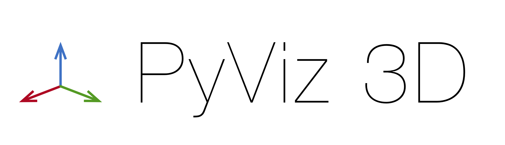
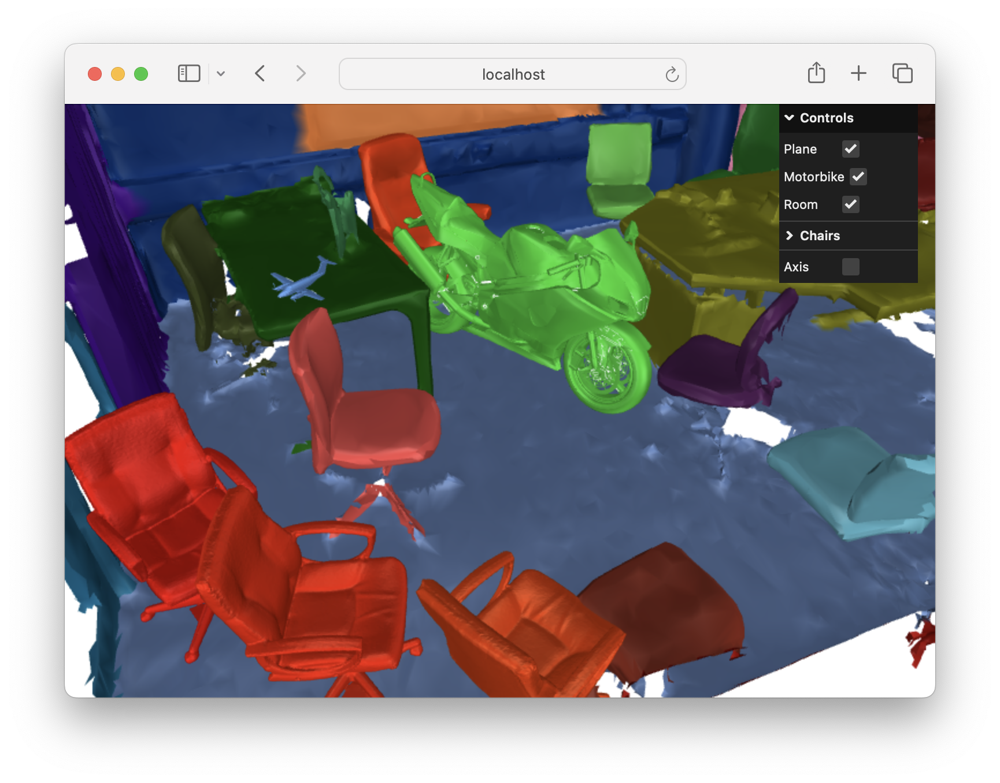
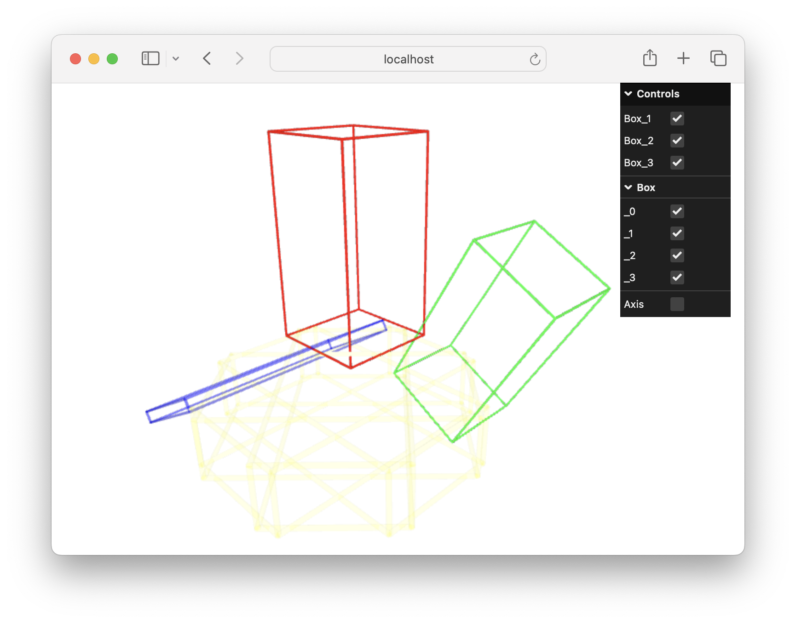
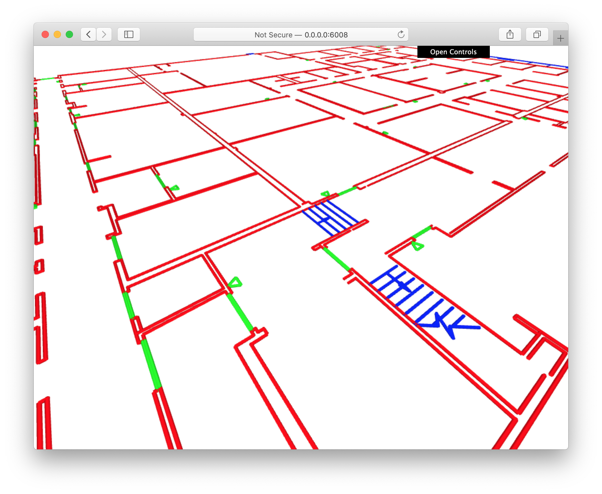
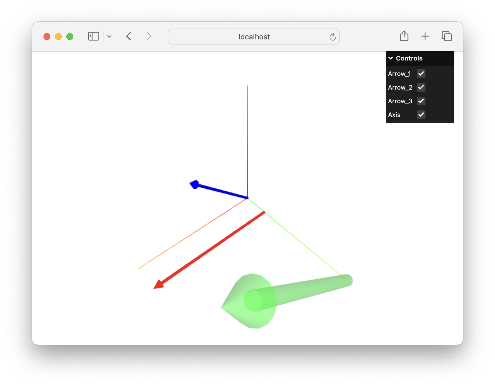
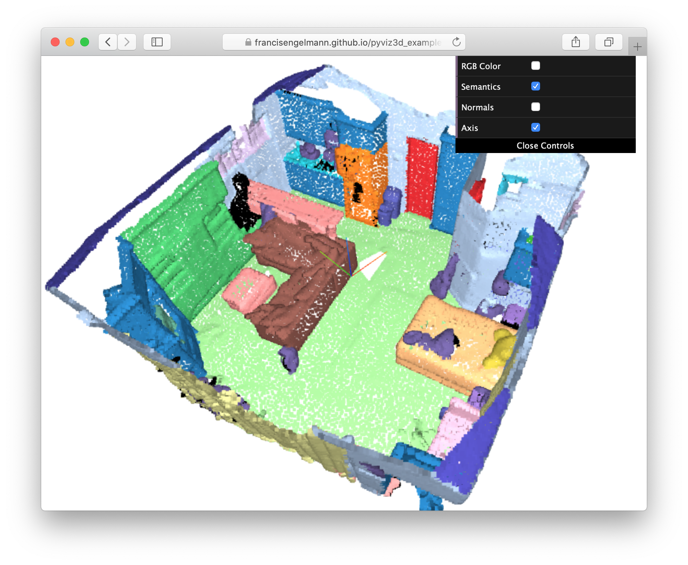

<p align="center"></p>

----
PyViz3D is a python package to visualize 3D scenes directly in your browser.

#### Links

- Install: ```pip install pyviz3d```
- [Documentation](https://francisengelmann.github.io/PyViz3D/)
- [Examples](https://github.com/francisengelmann/PyViz3D/tree/master/examples)

### Examples
Polygon meshes example.
[[Show Code]](https://github.com/francisengelmann/PyViz3D/blob/master/examples/example_meshes.py)
[[Show Demo]](https://francisengelmann.github.io/pyviz3d_examples/meshes/index.html)
[<p align="center"></p>](https://francisengelmann.github.io/pyviz3d_examples/meshes/index.html)

Bounding boxes example.
[[Show Code]](https://github.com/francisengelmann/PyViz3D/blob/master/examples/example_bounding_boxes.py)
[[Show Demo]](https://francisengelmann.github.io/pyviz3d_examples/bounding_boxes/index.html)
[<p align="center"></p>](https://francisengelmann.github.io/pyviz3d_examples/bounding_boxes/index.html)

Polyline example.
[[Show Code]](https://github.com/francisengelmann/PyViz3D/blob/master/examples/example_polylines.py)
[[Show Demo]](https://francisengelmann.github.io/pyviz3d_examples/polylines/index.html)
[<p align="center"></p>](https://francisengelmann.github.io/pyviz3d_examples/polylines/index.html)

Arrow example.
[[Show Code]](https://github.com/francisengelmann/PyViz3D/blob/master/examples/example_arrows.py)
[[Show Demo]](https://francisengelmann.github.io/pyviz3d_examples/arrows/index.html)
[<p align="center"></p>](https://francisengelmann.github.io/pyviz3d_examples/arrows/index.html)

Point clouds and segments example.
[[Show Code]](https://github.com/francisengelmann/PyViz3D/blob/master/examples/example_normals.py)
[[Show Demo]](https://francisengelmann.github.io/pyviz3d_examples/normals/index.html)
[<p align="center"></p>](https://francisengelmann.github.io/pyviz3d_examples/normals/index.html)
