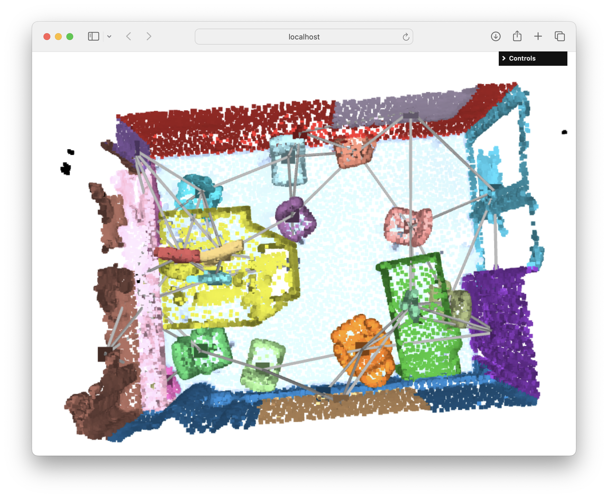
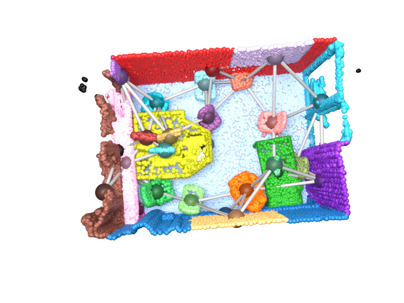
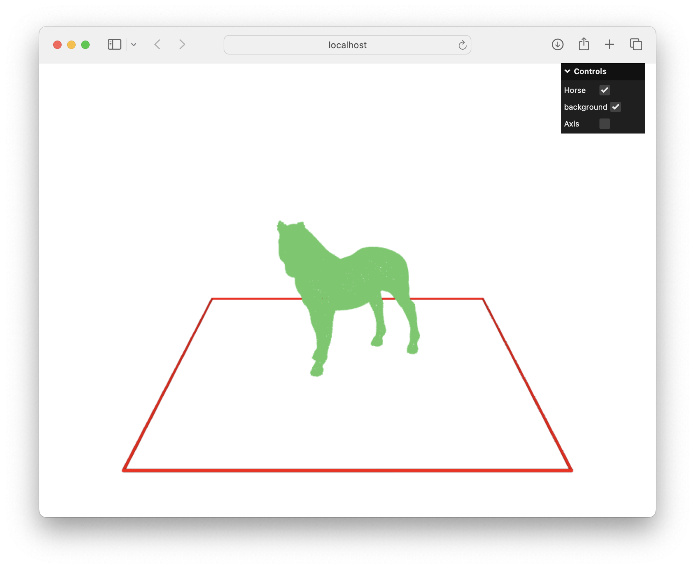
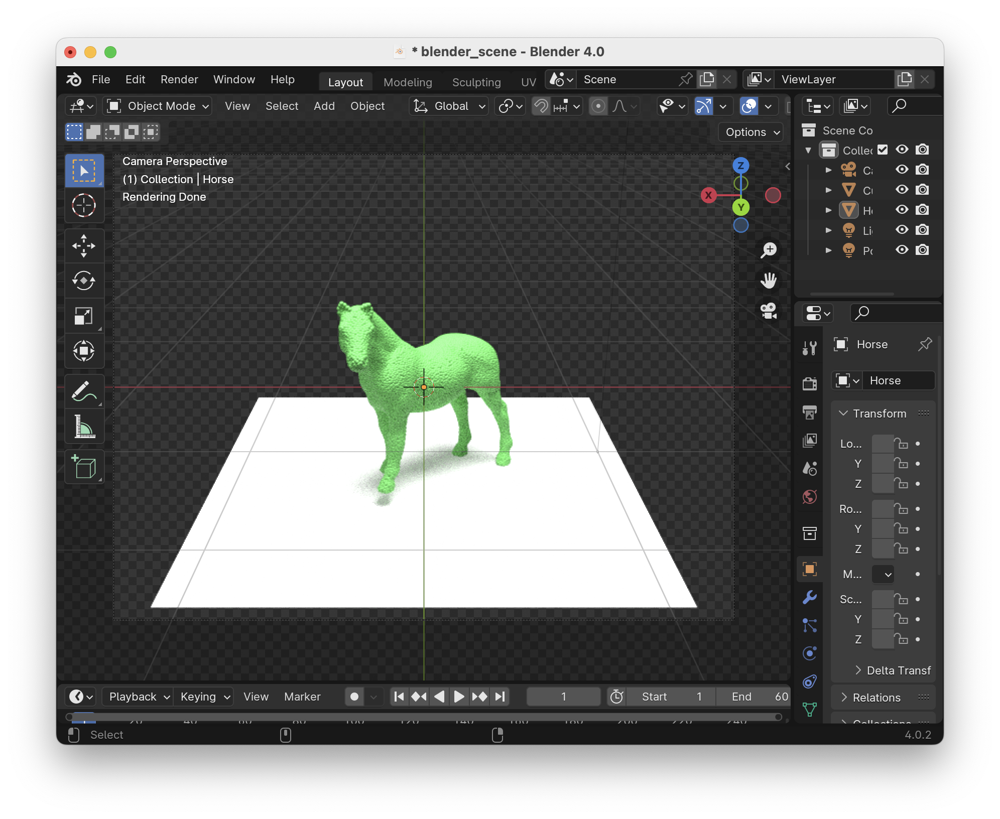
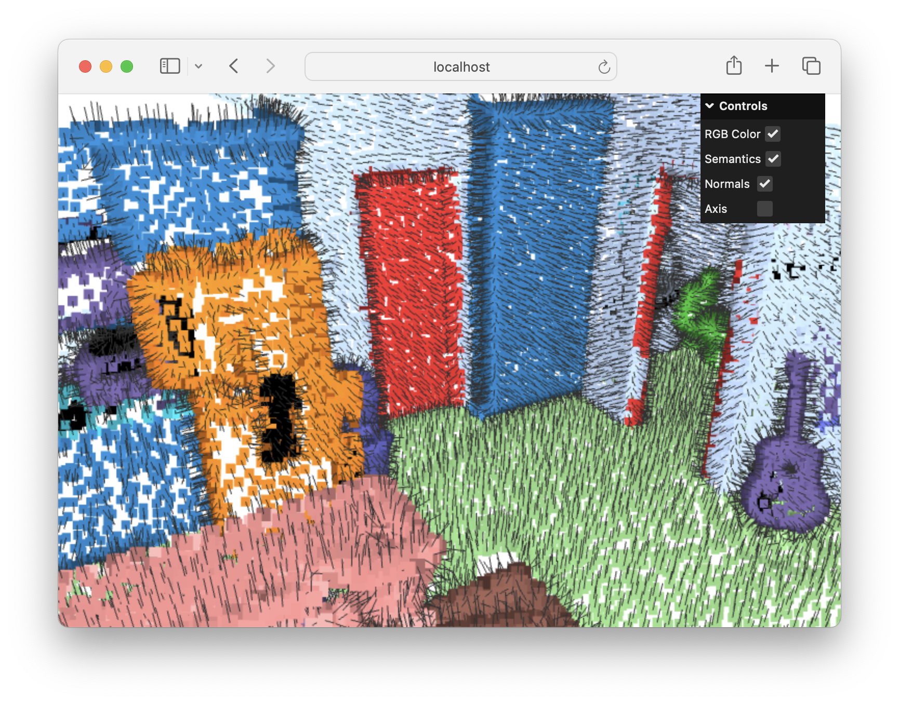
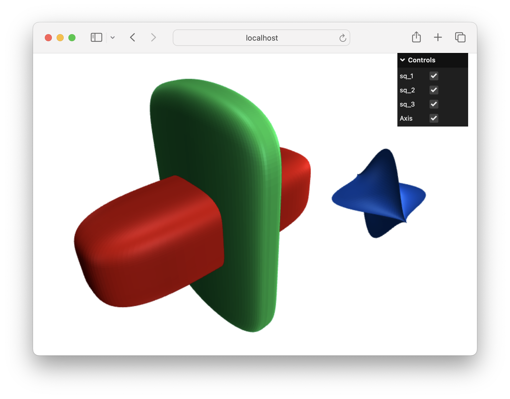
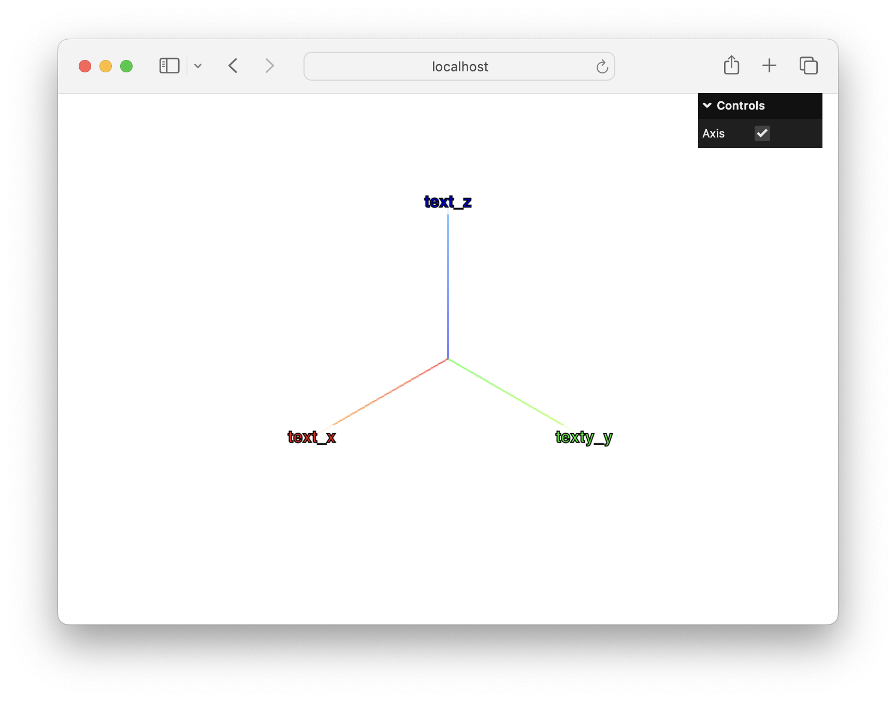

<p align="center"></p>

----
PyViz3D is a python package to visualize 3D scenes directly in your browser, and create beautiful renderings with blender.

#### Links

- Install: ```python -m pip install pyviz3d```
- [Examples](#examples)
- [Deployment](#deployment)

# Examples
Scene graph example, including blender rendering.
[[Show Code]](https://github.com/francisengelmann/PyViz3D/blob/master/examples/example_graph.py)
[[Show Demo]](https://francisengelmann.github.io/pyviz3d_examples/graph/index.html)
<p align="center">
  
  
</p>

Blender example, including blender rendering.
[[Show Code]](https://github.com/francisengelmann/PyViz3D/blob/master/examples/example_blender.py)
[[Show Demo]](https://francisengelmann.github.io/pyviz3d_examples/blender/index.html)
<p align="center">
  
  
</p>

Arrow example.
[[Show Code]](https://github.com/francisengelmann/PyViz3D/blob/master/examples/example_arrows.py)
[[Show Demo]](https://francisengelmann.github.io/pyviz3d_examples/arrows/index.html)
[<p align="center"></p>](https://francisengelmann.github.io/pyviz3d_examples/arrows/index.html)

Bounding boxes example.
[[Show Code]](https://github.com/francisengelmann/PyViz3D/blob/master/examples/example_bounding_boxes.py)
[[Show Demo]](https://francisengelmann.github.io/pyviz3d_examples/bounding_boxes/index.html)
[<p align="center"></p>](https://francisengelmann.github.io/pyviz3d_examples/bounding_boxes/index.html)

Polygon meshes (.obj and .ply).
[[Show Code]](https://github.com/francisengelmann/PyViz3D/blob/master/examples/example_meshes.py)
[[Show Demo]](https://francisengelmann.github.io/pyviz3d_examples/meshes/index.html)
[<p align="center"></p>](https://francisengelmann.github.io/pyviz3d_examples/meshes/index.html)

Point clouds, segments and normals.
[[Show Code]](https://github.com/francisengelmann/PyViz3D/blob/master/examples/example_normals.py)
[[Show Demo]](https://francisengelmann.github.io/pyviz3d_examples/normals/index.html)
[<p align="center"></p>](https://francisengelmann.github.io/pyviz3d_examples/normals/index.html)

Polylines.
[[Show Code]](https://github.com/francisengelmann/PyViz3D/blob/master/examples/example_polylines.py)
[[Show Demo]](https://francisengelmann.github.io/pyviz3d_examples/polylines/index.html)
[<p align="center"></p>](https://francisengelmann.github.io/pyviz3d_examples/polylines/index.html)

Superquadrics.
[[Show Code]](https://github.com/francisengelmann/PyViz3D/blob/master/examples/example_superquadrics.py)
[[Show Demo]](https://francisengelmann.github.io/pyviz3d_examples/superquadrics/index.html)
[<p align="center"></p>](https://francisengelmann.github.io/pyviz3d_examples/superquadrics/index.html)

Text Labels.
[[Show Code]](https://github.com/francisengelmann/PyViz3D/blob/master/examples/example_text.py)
[[Show Demo]](https://francisengelmann.github.io/pyviz3d_examples/text/index.html)
[<p align="center"></p>](https://francisengelmann.github.io/pyviz3d_examples/text/index.html)

<!-- # Blender
To create beautiful illustrations with blender consider the following points:
- Install Blender from https://www.blender.org/ (tested version 4.0).
- Calling `v.save(..., show_in_blender=True)` creates a `.blend` file which you can open in blender.
- Check `examples/examples_graph.py` for a complete example. -->
<!-- 2. Set up alias in you ~/.bashrc or ~/.zshrc etc. -->
<!-- `alias blender="/Applications/Blender.app/Contents/MacOS/Blender"` -->
<!-- then `source ~/.zshrc` -->
<!-- 2. `blender myscene.blend --background --python blender.py` -->
<!-- currently there is no myscene.blend to remove that: `blender --background --python blender.py` -->
<!-- Select camera: View/Cameras/Active Camera     -->
<!-- Lock camera to view:   -->
<!-- Press N to show sidebar.   -->
<!-- Under View, lock camera to view.   -->
<!-- Control the camera with the small coordinate frame on the top right. -->
<!-- 5. This will render an `output.png` -->
<!-- 6. The scene can also be opened in blender `bunny.blend` -->
<!-- 7. Need to install ffmpeg and convert (on mac via brew)   -->
<!-- brew install ffmpeg -->

# Deployment

[Instructions for PyPi](https://packaging.python.org/en/latest/tutorials/packaging-projects/) and [API Token](https://packaging.python.org/en/latest/guides/distributing-packages-using-setuptools/#create-an-account).

One time setup:
```
vim ~/.pypirc  # put __token__ as username 
python3 -m pip install build twine
python3 -m pip install --upgrade build
```

Upload latest version to pypi:
```
vim pyproject.toml  # update version
rm -rf dist
rm -rf example_*
python3 -m build
python3 -m twine upload dist/*
```

# BibTeX
Please consider citing PyViz3D in your publications if it helps your research.
```
@misc{engelmann2019pyviz3d,
  title={PyViz3D},
  author={Francis Engelmann},
  year={2019},
  howpublished={\url{https://github.com/francisengelmann/PyViz3D}},
}
```